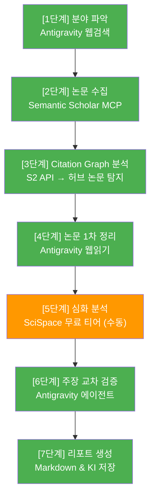

# 논문 연구 자동화 워크플로 가이드

> **비용 $0 기반 최적화 워크플로 (Antigravity & Semantic Scholar MCP 활용)**

SOTA(State-of-the-Art)급 논문을 효율적으로 검색, 분석, 구조화하기 위한 7단계 워크플로입니다.

---

## 🚀 아키텍처 개요

기존 유료 API(Perplexity, Elicit, Consensus 등)에 의존하지 않고, **무료 MCP(Model Context Protocol)와 Antigravity 에이전트의 내장 기능만으로 80% 이상의 자동화를 달성**하는 구조입니다.

> 🟢 1~4, 6~7단계: AI 에이전트 완전 자동화 | 🟠 5단계: 수동 심화 분석

---

## 🛠️ 단계별 실행 가이드

### [1단계] 분야 파악 (Seed Keyword & Paper 도출)

- **도구**: Antigravity 내장 웹검색 (`search_web`)
- **방법**: 에이전트에게 포괄적인 질문을 던져, 핵심 키워드 3~4개를 추출하게 합니다.

### [2단계] 논문 수집 (Seed Expansion)

- **도구**: Semantic Scholar MCP / arXiv MCP
- **방법**: 1단계에서 얻은 키워드를 바탕으로 에이전트가 S2 MCP를 통해 대량 검색을 수행합니다.
- **필터링 기준**: `연도 ≥ 2018`, `인용수 ≥ 10`, `Open Access` 우선. 이 과정을 통해 30~50편의 후보군을 만듭니다.

### [3단계] Citation Graph 분석 (허브 논문 탐지) ⭐ 핵심

- **도구**: Semantic Scholar API (에이전트 자동화)
- **방법**: 시각화 도구(ResearchRabbit 등) 대신, 에이전트가 Seed 논문의 **Backward(참고문헌)**와 **Forward(후속 인용)**를 추적합니다.
- **목표**: 양쪽에서 공통으로 교차 인용되는 **'Hub(허브) 논문'**을 자동으로 찾아냅니다. (예: 진동-졸음 메커니즘을 증명한 Zhang 2018 발굴)

### [4단계] 논문 1차 정리 (Abstract & 방법론 파싱)

- **도구**: Antigravity 내장 웹읽기 (`read_url_content`)
- **방법**: 3단계를 통과한 핵심 논문들의 원문 URL(PMC, arXiv 등)을 에이전트가 직접 읽고 `Abstract`, `Methods`, `Results`를 파싱합니다.
- **산출물**: 하드웨어 스펙과 논문 결론을 매핑한 비교 테이블 자동 생성.

### [5단계] 심화 분석 (수동 정밀 분석)

- **도구**: [SciSpace](https://scispace.com/) (무료 티어)
- **방법**: AI 자동화를 거친 **최종 최우선 순위 논문(Top 3~5편)**의 PDF를 직접 다운로드하여 SciSpace에 업로드합니다.
- **목표**: 논문 내 특정 수식, 하드웨어 설정값, 실험 통계 데이터 등 에이전트가 놓치기 쉬운 딥스펙(Deep Spec)을 대화형으로 파고들어 질문합니다.

### [6단계] 특정 주장 교차 검증

- **도구**: Antigravity 에이전트 교차 검증
- **방법**: "이 주장을 지지하는가?"(Consensus/Scite 대체)를 에이전트가 직접 수행합니다. 확보된 논문들의 결론이 상호 충돌하는지, 마중의 가설(예: 30Hz 진동이 부교감신경 활성화)을 완벽히 지지하는지 검증합니다.

### [7단계] 리포트 생성 및 자산화

- **도구**: Antigravity 에이전트
- **방법**: 최종 분석 결과를 마크다운(Markdown) 리포트 파일로 자동 저장합니다.
- **영구 지식화**: 향후 펌웨어 개발 시 에이전트가 참고할 수 있도록 Antigravity의 **Knowledge Item (KI)**으로 핵심 스펙 매핑 데이터를 영구 등록합니다.

---

## 💡 에이전트 프롬프트 예시 (이 워크플로 실행용)

Antigravity 에이전트에게 새로운 분야 조사를 지시할 때 아래 프롬프트를 활용하세요.

> **"논문 연구 자동화 워크플로를 따라 [] 트랙의 문헌 조사를 시작해줘. 1단계로 웹검색을 통해 핵심 키워드를 찾고, 바로 2~3단계인 Semantic Scholar MCP를 활용해 허브 논문까지 추출해서 표로 보여줘."**
